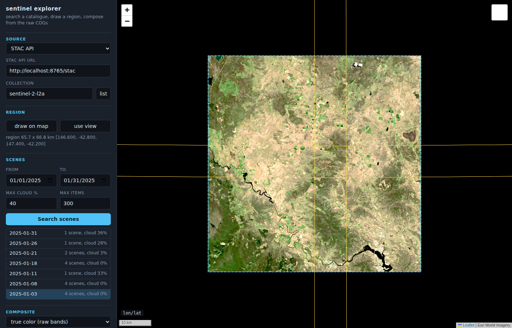

# rangefinder

A static, server-free explorer for online imagery and gridded data. Point it
at a STAC API (default: Earth Search v1, `sentinel-2-l2a`), a published starc
store, the wildtiles cube, a GDAL VRT mosaic, a list of COG URLs, a map
tile server (XYZ or WMTS, any tile matrix set) or a Zarr store, draw a
region on the map, search, scrub through the days, and the page reads the
COGs directly by HTTP range request and composes the image in the browser:
three bands to RGB, one band through a colour ramp (with hillshade for
elevation), or class codes through a palette.

Live: https://hypertidy.github.io/rangefinder/ (deployed from `main` by
`.github/workflows/pages.yml`).

Two ways to open it locally:

- `explorer.html`: a single self-contained file. Double-click it or open it
  from disk; it needs only network access to the CDNs, the catalogue and
  the imagery bucket. Generated by `python3 dev/build_standalone.py`, so
  don't edit it directly.
- `index.html`: the same page loading `lib/` as ES modules. Browsers refuse
  modules from `file://`, so this one needs an HTTP server (GitHub Pages,
  `python3 -m http.server`).

## Using it

1. **Source.** STAC API URL + collection (the `list` button reads
   `/collections`; several collections, comma separated, are searched
   together). Its "common catalogues" picker fills both in for Earth
   Search, Digital Earth Australia (Sentinel-2 and Landsat ARD, geomedians,
   fractional cover, water observations, land cover), Digital Earth Pacific
   (annual Sentinel-2, Landsat and Sentinel-1 SAR geomedians), Digital Earth
   Africa and Planetary Computer (Sentinel-1 RTC). SAR collections offer
   VV and VH backscatter and a VV, VH, VV composite on a log10 curve; a
   starc store URL ([in-dev]: an experimental format
   from a related project, listed last) (`read store` shows what it holds,
   draws its tiles and sets the dates to its span; see `docs/starc.md`);
   or the wildtiles bucket and tile resolution ([in-dev] likewise). Choosing wildtiles reads the
   bucket's three well-known keys (`index/inventory.parquet`,
   `registry/tiles.parquet`, `registry/BANDS.txt`): its regions fill the
   region picker and are outlined on the map, and extra bands such as
   `cloud` and `snow` join the band pickers. A **GDAL VRT mosaic** (default:
   REMA v2 32 m, Antarctica) is read once as the index of every file it
   mosaics, and the files are outlined. A VRT's GDAL `<Overview>` elements
   (nested VRTs or COGs) are used too: a search picks the coarsest overview
   no coarser than the output pixel, so a whole-continent region reads a
   coarse mosaic and a small one reads the full-resolution tiles (files in
   Git LFS are skipped, since GitHub does not serve them to web pages);
   **COG files** takes pasted URLs (common files include GEBCO 2024-2026
   on source.coop) and
   reads only their headers to place them. Neither has a time axis or cloud
   cover, so those controls hide, and a search loads straight away. A **tile
   server** is an XYZ template (`{z}/{x}/{y}`, `{-y}`, `{q}`, `{s}`) or a
   WMTS GetCapabilities URL: `read` lists its layers, tile matrix sets (in
   any CRS: a polar stereographic pyramid works like a Web Mercator one)
   and formats, and a WMTS time dimension becomes the day list and timeline.
   Tiles go through the same warp as COGs, at the level that suits the
   region. Elevation packed into RGB (terrarium, Mapbox terrain-RGB) is
   decoded to metres, so it gets ramps and hillshade like a DEM. A **Zarr
   store** (default: MUR SST on AWS) is read with zarrita through its
   consolidated metadata: `read` lists the gridded variables, and the chosen
   one's coordinates give its grid, CRS and times (see "Zarr" below).
   Each of these sources has a "common ..." picker (servers, files,
   mosaics, stores) that fills in a known public URL and reads it; pasting
   your own URL and leaving the box (or pressing `read`) does the same. An
   `http://` URL is fetched over https when the page itself is on https,
   since browsers block the mixed request.
2. **Region.** `draw on map`, then drag a box; or `use view`. With
   `swath-aligned region` ticked the box becomes a parallelogram along the
   Sentinel-2 ground track (about 13 to 15 degrees east of north over
   Australia), so a region can follow one swath; see
   `docs/clear-day-scan.md`. With
   `follow the map` ticked, the view becomes the region whenever the map
   stops moving and is read again (same day and composite), so zooming in
   reads finer overviews or full-resolution files and zooming out coarser. **Map and
   output CRS** sets the projection the map is drawn in and the composite
   is built in. The choices are Web Mercator (the default), Antarctic or
   Arctic polar stereographic, Australian Albers, the UTM zone of the
   view, lon/lat, or any EPSG code.
   - A box is drawn square in that CRS, so a polar region is a true polar
     box, not a lon/lat one.
   - Changing the CRS keeps the region and the scenes and composes the
     current day again on the new grid.
   - Outside Web Mercator the basemap is Esri imagery warped into the CRS
     for each view, with the same warp the composites use. Mercator tiles
     stop at 85 degrees, so a polar view has a hole at the pole.
   - There is no reprojection while panning: the map simply is that
     projection.
3. **Scenes.** Date range (a blank date is an open end), max cloud,
   `Search scenes`. Results are grouped by solar day (local date at the
   scene centre). Click a day to load it, or use the timeline.
   The search itself has no cloud filter: the max cloud box and the slider
   under `Search scenes` apply the limit to the result, live. Each day row
   shows a glyph of that day's footprints over the region (filled for
   scenes under the limit, more opaque the clearer), how much of the
   region its clear scenes cover, and clear / flown scene counts. Sort by
   region covered (default), clear of flown, clear scenes or date, and
   hide days below a minimum scene count or cover. Hovering a row draws
   the day's scene thumbnails in place; `score sharpness from thumbnails`
   adds a haze proxy as a sort key for the listed days. The selected day's
   footprints are coloured by cloud cover (green clear to red), with
   scenes over the limit dashed. See `docs/clear-day-scan.md`.
4. **Timeline.** Under the map once a search returns: one bar per day on a
   true time axis, taller for clearer days, brighter once read. Drag or
   click it, `<` / `>` (or the arrow keys, `[` / `]`), or `play` (key `p`)
   to step through the days, reading the next two ahead. Days already read
   come back from a cache without refetching, and a new view, a band change
   or another day reuses any native tile or chunk read before (see
   "Caching" below). "hold limits" keeps the
   current min/max for every day so dates compare like for like.
5. **Composite.** The picker lists what the scenes actually carry: the
   Sentinel-2 combinations when those bands are there, then every asset on
   its own. One band goes through a colour ramp (terrain, viridis, ice,
   bathy, ..., and Fabio Crameri's perceptually uniform scientific maps:
   batlow, roma, vik, oslo, ...), optionally reversed, with optional hillshade, which elevation assets get by
   default. An **absolute** palette pins colours to data values instead of
   the stretch limits, so a value has the same colour in every view: the
   AAD DiRT bathymetry palette (-8000 to 1000 m, from
   [palr](https://github.com/AustralianAntarcticDivision/palr)) is built in,
   and "custom" takes one `value colour` per line (`#rrggbb` or `r g b`, as
   for `gdaldem color-relief`), kept in the permalink; class codes (S2 `scl`, or any asset with STAC
   `classification:classes`) go through a palette with a legend. For RGB:
   TCI (the baked 3-band Byte product, fastest) or any three
   raw bands. Limits are percentiles over the whole region (default 2-98%,
   so mosaics stay seamless) or manual per-band min/max; "same limits for
   all bands" keeps true-colour balance. Then a stretch curve (linear, sqrt,
   log, or "log10 of values", a true log colour scale between the limits
   for data such as chlorophyll), gamma, and the L2A -1000 offset (auto from scene metadata, always,
   or off). Everything re-renders the cached pixels without refetching, and
   "show imagery" (key `i`) toggles the overlay.
   For one band, `use this day as reference` keeps the current day's
   composite, and `show difference` then shows each day minus the
   reference (offset-corrected values, a diverging ramp, limits symmetric
   about zero). The readout, statistics and GeoTIFF export follow the
   difference; the permalink keeps it (`ref`, `diff`).
6. **Inspect tiles.** For a tile server: `grid` draws the tile grid of the
   chosen level over the map view in the server's own CRS (a polar
   pyramid shows as the curved lattice it is), with no requests; `probe`
   requests every tile of that level in view and colours each by what came
   back (data, partial, empty, blank, missing, error, or placeholder: the
   same bytes repeated, which is how many servers answer outside their
   coverage); `walk` descends from that level requesting only the children
   of tiles that have data, within the request budget, and flags a tile
   that is just its parent upsampled, so it finds where native resolution
   really ends on a patchy server. For any source, `last read` draws what
   the last load fetched: the map tiles, each COG's internal tiles at the
   overview it was read at (whole tiles are fetched, so this is the read
   amplification), or the Zarr chunks. Click a cell to see the tile as served, with its HTTP
   status, size, type and hash.
7. **Values.** Hovering the image shows the composite's numbers under
   the cursor next to lon/lat: each band's value (with the L2A offset
   applied when it is, and the stored number beside it), its unit when the
   source gives one, the class name for a class map, or "no data", plus
   the output pixel. After each load the status line gives min, max and
   mean per band over the valid pixels. NaN and infinities never enter
   them; they are counted apart. These are the composite's values, so they
   are on the output grid: nearest-neighbour samples of the source, from
   the overview that was read.
   **Click** the image to pin a point: its value on every searched day is
   plotted on the days' time axis under "point" (click a dot to go to that
   day; `csv` saves the series). A day already composed is read from its
   cached composite; any other day reads just that one output pixel at the
   same pixel size, so it matches a full read of that day. The 40 days
   nearest the current one are read first; `read all days` reads the rest.
   The L2A offset is worked out per day, so a series across the 2022
   baseline change stays comparable. For a Zarr variable with another
   dimension (depth, level, s-coordinate), `profile` plots the pinned
   pixel's value at every level for the day shown, down the page by depth
   (from the coordinate in metres, or from the ROMS stretching for an
   s-coordinate; click a level to show it on the map, `profile csv` saves
   it).
8. **Export.** `GeoTIFF` saves the composite's values (not its colours)
   on the output grid, in their own data type. The CRS, extent and nodata
   are in the file, and so are each band's name, offset and unit (GDAL
   metadata), plus the provenance: permalink, day, scenes in priority order,
   and where the CRS definition came from. `source VRT` saves a GDAL VRT
   that rebuilds the composite from its source files rather than holding
   pixels. For each band it has an inline GDAL tile index (GTI, so GDAL 3.9
   or later) of the scenes' files over `/vsicurl/`, the first-ranked scene
   on top, warped to the same grid. A Zarr slice goes through GDAL's Zarr
   driver with its packing kept. GDAL can read it as is, or `gdalwarp` /
   `gdal_translate` it to another grid. Its values match the GeoTIFF up to
   nearest-neighbour choices (93-97% of pixels identical in tests; the rest
   take a neighbouring source pixel, since GDAL's warper and rangefinder's
   lattice place sample points slightly differently). Tile servers have no source VRT. `PNG`
   saves the picture as shown, with a `.png.aux.xml` (GDAL PAM) beside it
   carrying the CRS and extent.
9. **Output size** caps the longer side of the output grid; it is also never
   finer than the data (the scenes' own resolution when they say, else 10 m). **Max scenes** caps how many scenes one load reads.

The URL hash is a permalink (source, map CRS, region, dates, composite, day).



## Layout

```
index.html               thin page: UI and wiring only
explorer.html            generated single-file copy (works from file://)
lib/explorer.js          entry point; re-exports, groupByDay(), loadComposite()
lib/geo.js               layer 1: CRS helpers, OutputGrid, solar day
lib/scan.js              clear-day scan: per-day counts, region cover, sort/filter, sharpness
lib/sources/stac.js      layers 1+2: STAC API binding (Catalog interface doc)
lib/sources/starc.js     layers 1+2: starc store binding (acquisitions/products/assets)
lib/sources/wildtiles.js layers 1+2: wildtiles binding (inventory, tile registry, BANDS.txt)
lib/sources/vrt.js       layers 1+2: GDAL VRT mosaic (the VRT is the file index)
lib/sources/cog.js       layers 1+2: pasted COG URLs (headers only)
lib/sources/tiles.js     layers 1+2: XYZ template or WMTS capabilities (layers, sets, times)
lib/sources/zarr.js      layers 1-3: one variable of a Zarr store (zarrita), chunk reads, profiles
lib/curvilinear.js       cell footprints of 2D lon/lat grids, projected and rasterised
lib/dggs.js              HEALPix grids: detection, healpix-geo (wasm), the inverse read
lib/cog.js               layer 3: windowed overview reads warped to the grid
lib/chunks.js            shared byte-budgeted cache of native tiles and chunks
lib/tiles.js             layer 3: tile matrix sets, URL templates, tile fetch/decode,
                         the same warp for tile pyramids, WMTS capabilities parsing
lib/mapcrs.js            Leaflet in any CRS: a CRS from proj4, overlays placed by extent,
                         a basemap warped into the view
lib/export.js            GeoTIFF writer, source VRT (inline GTI per band), PAM sidecar
lib/inspect.js           the tile inspector: tile grids, probes, coverage walk,
                         overzoom check, COG read tiles
lib/render.js            layer 4: mosaic, stretch curves, L2A offset, gamma, ramps,
                         hillshade, class palettes -> RGBA
dev/                     mock STAC server, headless test, fixture and standalone builders
docs/design.md           the original design notes (four layers, minimal path)
docs/rgb-compositing.md  compositing controls and the L2A offset findings
docs/starc.md            publishing and reading a starc store
docs/fidelity.md         what the numbers are: exact, approximated, display only
docs/clear-day-scan.md   finding the clearest day over a region from one search
docs/sources-brainstorm.md  beyond Sentinel-2: other sources, tile servers
```

Dependencies are globals loaded by the page from cdnjs/jsdelivr: Leaflet
1.9.4, proj4 2.11.0, geotiff.js 2.1.3. The wildtiles and starc sources
import hyparquet from jsdelivr on demand, and the Zarr source imports
zarrita 0.7 the same way (esm.sh as a fallback). No build step.

## How a load works

1. `makeGrid(roi)` builds one **OutputGrid**: a Web Mercator box with a pixel
   size. Every scene, whatever its UTM zone, is warped onto this grid, so
   mosaics are seamless across zone seams and the result overlays Leaflet
   exactly.
2. `loadComposite()` keeps scenes that overlap the grid and have the needed
   assets, sorts them least-cloudy first and reads at most `maxScenes`.
3. `readWarped(href, grid)` (lib/cog.js) reprojects a lattice of grid pixels
   (every 16 px) into the file's CRS, takes the covered window, picks the
   coarsest overview that is still as fine as the grid (or the coarsest
   of all with `lowest overview (fast scan)` ticked), reads the file's
   own tiles under that window (each decoded once and cached), and resamples nearest-neighbour with bilinear coordinate
   interpolation inside each lattice cell.
4. `mosaic()` fills each grid pixel from the first scene with valid data.
5. `autoStretch()` + `renderRGBA()` turn the composite into RGBA, drawn into
   a canvas overlay that is updated in place on re-stretch.

## Interfaces (for new sources and later UI)

**Catalog** (see `lib/sources/stac.js`):

```
catalog.label, catalog.bands
catalog.search({ bbox, datetime: "YYYY-MM-DD/YYYY-MM-DD", cloudMax, maxItems, signal })
  -> Promise<Scene[]>
Scene = { id, day, datetime, geometry, bbox, cloud, crs, assets: { key: href },
          assetMeta: { key: { band, nodata, scale, offset, dataType, classes, rgb } },
          meta: { res, ... } }
catalog.capabilities = { cloud, time }   (optional; hides controls a source can't use)
catalog.presets, catalog.maxScenes       (optional)
```

`assetMeta` is optional per key: `band` picks a band (0-based) inside a
multi-band file, `nodata` applies when the file declares none, `classes`
(`[{ value, label, color }]`) makes the asset a class map. A source without
time uses the day `"undated"`. `presetsFor(catalog, scenes)` turns what the
scenes carry into the composite picker; preset ids (`mode:key,key`, mode one
of `rgb`, `bands`, `single`, `classes`) are what the permalink stores.

Asset keys are logical band names (`visual`, `red`, `green`, `blue`, `nir`,
`swir16`, ...). The STAC binding maps them from asset names, the `B04`-style
names, or `eo:bands` common names, so catalogues other than Earth Search work
when their assets are public COGs. Assets beyond those names (a DEM's
`data`, a land cover `map`, ...) are kept under their own names, with nodata,
scale, offset and classes from the STAC raster and classification
extensions.

**Composite / RenderParams** (see `lib/render.js`):

```
Composite    = { grid, kind: "rgb8" | "bands" | "single" | "classes",
                 channels: [R, G, B] or [V], valid, keys, classes }
RenderParams = { stretch: [[lo, hi] x3 or x1], gamma, transfer: "linear",
                 ramp, hillshade (0..1), shade }
```

**TileSource** (see `lib/tiles.js`): a Scene asset can be an object instead
of an href, and `loadComposite` reads it with `readTilesWarped` instead of
`readWarped`:

```
TileSource = { kind: "tiles", template, tms, format: "rgb" | "terrarium" | "mapbox",
               time, minzoom, maxzoom, subdomains }
tms        = { id, crs, levels: [{ id, cell, origin: [x, y], tileWidth, tileHeight,
                                   matrixWidth, matrixHeight, limits? }] }
```

A read returns the usual `{ bands, valid, level }` plus `log`: one entry per
tile (url, status, bytes, ms, hash), which the status line summarises.

**Zarr** (see `lib/sources/zarr.js`): the asset is
`{ kind: "zarr", url, variable, index, crs, sel }`, read by `readZarrWarped`.
`index` is the position on the time axis (-1 without one). Minimal by
design:

- A URL ending in `.json` is a Kerchunk / VirtualiZarr reference file
  (versions 0 and 1, with templates; not `gen`). Its keys are inline
  metadata or byte ranges of other files, so a NetCDF-4/HDF5 or GRIB2
  archive with references reads like a Zarr store. The referenced files
  need CORS with ranges. `s3://` and `gs://` URLs become their public
  https endpoints. Without a `.zmetadata` of its own, one is built from
  the inline metadata so the variables list. HDF5 shuffle + zlib come
  through zarrita's codecs.
- A URL ending in `.parq` or `.parquet` (or a directory whose
  `.zmetadata` has `record_size`) is a Kerchunk Parquet reference store:
  `<var>/refs.<n>.parq` files with `path`, `offset`, `size`, `raw`
  columns, one row per chunk in C order. Only the file holding a chunk is
  read (hyparquet, with hyparquet-compressors for ZSTD), and the last 12
  are kept. One-element attribute arrays (as R writers make them) are
  unwrapped and bare `NaN` in the JSON is tolerated.
- An Icechunk repository (see `docs/icechunk.md`) is read with
  icechunk-js 0.6, loaded on demand: a URL starting `icechunk+https://`,
  carrying `?icechunk` / `#icechunk` or `?branch=` / `?tag=` /
  `?snapshot=`, or ending `.icechunk` says so; otherwise a URL with
  neither `.zmetadata` nor `zarr.json` is sniffed for a v2 `repo` object
  or a v1 main branch ref. The snapshot's node list stands in for
  consolidated metadata. Sharded v3 arrays read inner chunks as byte
  ranges; each shard's bytes are shared out among the chunks read from it
  in the cost log. The snapshot a branch or tag resolved to is shown and
  written to the permalink (`zsnap`), so a link reopens that version.
  Virtual chunks need their own bucket's CORS; a failed chunk read names
  the repository's virtual chunk containers. No VRT export (GDAL has no
  Icechunk driver). The picker has dynamical.org's GFS and HRRR analyses.
- The "common stores" picker has BRAN2023 (temp, salt, eta, mld, u, v as
  Kerchunk Parquet from mdsumner/virtualized, plus one Zarr build). Their
  chunks are on NCI THREDDS, which must allow cross-origin reads.
- A 1D x or y coordinate that is monotonic but unevenly spaced (a
  rectilinear grid, such as HYCOM's latitude) is read in index space,
  interpolating the coordinate values; the info line says so.
- Dimensions come from `_ARRAY_DIMENSIONS` (v2) or `dimension_names` (v3).
  x, y and time are recognised by name or CF attributes (units
  `degrees_east` / `... since ...`, `axis`, `standard_name`). Every other
  dimension (depth, level, ...) gets a picker under the variable, labelled
  with its coordinate values and units when it has a 1D coordinate; `sel`
  (`{ name: index }`, hash key `zsel`) holds the choices, and changing one
  re-reads the same day (and the pinned point's series) at that slice.
- x and y need regular 1D coordinate arrays, or the variable's
  `coordinates` (else any arrays in the store) must name 2D longitude and
  latitude over two of its dimensions: a curvilinear grid (ROMS, NEMO,
  MOM tripolar, rotated pole; see `lib/curvilinear.js`). 2D lon/lat win
  over 1D x/y unless the variable has a `grid_mapping`, since on these
  grids the 1D axes are often nominal. Each cell is drawn as its
  footprint: the CF `bounds` of the coordinates, else the ROMS psi points,
  else corners half way between centres. Every output pixel takes the cell
  whose footprint holds its centre, found exactly (no lattice); where
  footprints overlap (ROMS gives land cells made-up coordinates), a cell
  with data wins. Footprints are projected once per CRS and rasterised once
  per grid, so stepping days costs only the chunk reads. Cells across the
  antimeridian are drawn on both sides in lon/lat and Web Mercator. No
  source VRT for these yet (the GeoTIFF works). Longitudes 0..360 are
  wrapped.
- A HEALPix variable (one cell dimension, no coordinates; see
  `lib/dggs.js` and `docs/healpix.md`) is recognised by xdggs / Zarr DGGS
  attributes (`grid_name`, `level`, `indexing_scheme`, or `dggs`), a CF
  grid mapping (`grid_mapping_name: healpix`, `healpix_nside`,
  `healpix_order`) or a `crs` attribute dictionary, on the variable, its
  coordinates, a `crs` variable or the root group. The read inverts the
  view: each output pixel's centre goes to lon/lat, to a cell id
  (healpix-geo, loaded from jsdelivr on first use), to its chunk; nested
  and ring are both read as stored. A `cell_ids` coordinate that is not
  0 .. 12 nside^2 - 1 (a regional subset) is used as the cell list. The
  sphere is assumed (and flagged) unless the attributes name an
  ellipsoid. Past the chunk cap the most-used chunks are read and the rest
  are left empty and shown as "not read" in the inspector. Pinning a point
  outlines its cell. No source VRT.
- The CRS is EPSG:4326 for lon/lat axes, else the variable's
  `grid_mapping` (`crs_wkt` / `spatial_ref`), else `proj:code` / `crs`
  attributes, else the CRS box on the page.
- Values are unpacked with `scale_factor` / `add_offset`, and the fill
  value or `missing_value` becomes NaN.
- Times decode from CF units and the `calendar` (`noleap` / `365_day`,
  `all_leap` / `366_day` and `360_day` count days their own way: a model's
  15 December stays 15 December); a long time axis that is regular in its
  first and last chunks is not read chunk by chunk. Times are grouped by
  day, so hourly steps of one day are mosaicked as one day (the first
  wins).
- An ocean s-coordinate (`standard_name` `ocean_s_coordinate*`, positive
  up) starts at its surface level rather than index 0.

A read fetches whole chunks, the only unit a store has, so the chunk shape
sets what a view costs. Reads are capped at 64 chunks or 400 MB decoded.
Decoded chunks stay in the shared chunk cache, so stepping through days
that share a chunk refetches nothing. Each chunk is logged like a map
tile, so `last read` draws the chunk grid.
```

Extension points left for the next pieces of work:

- **RGB compositing controls** (done): `TRANSFERS` has linear/sqrt/log,
  `autoStretch(comp, lo, hi, { joint, offset })`, `RenderParams.offset`, and
  `sceneOffset()` decides the L2A offset (a source can force it with
  `scene.meta.dnOffset`). Details and the pixel checks behind the offset
  rule are in `docs/rgb-compositing.md`.
- **Time scrubber** (done): a canvas timeline over `state.days`; loads go
  through `dayComposite(i)`, a per-day cache keyed by day, bands, grid and
  scene cap (400 MB, least recently used out), which `play` also uses to
  read two days ahead. `window.explorer` exposes `stepDay`, `play`,
  `stopPlay`, `selectDay`.
- **starc store source** (done): `starcCatalog({ url, collection })`, plus
  `info()` for the store summary. Footprints come from `footprint_wkb` or
  the MGRS tile code (`mgrsExtent()` in geo.js). Details in
  `docs/starc.md`.

## Caching

Two levels, both in memory for the life of the page:

1. **Native pieces** (`lib/chunks.js`): one cache, 512 MB by default
   (`setChunkBudget(bytes)`), least recently used out. It holds decoded
   pieces exactly as the source stores them, keyed by the source's own
   grid, not by the view that asked:
   - COG: one internal tile (or strip) of one overview level of one file,
     all its samples, decoded.
   - Zarr: one chunk of one array, decoded.
   - XYZ/WMTS: one tile, decoded image plus its bytes (failed tiles too,
     so a known hole is not asked for again).

   So a pan, a zoom that stays on the same overview level, a band
   combination sharing files with the last one, or a day revisited under a
   different grid only fetches the tiles it has not seen. Two reads that
   want the same piece at once share one request, and a request is only
   cancelled when every read waiting on it is (a cancelled read-ahead does
   not take the visible load down with it). The status line says how many
   tiles or chunks came from the cache, and the cache's size.
2. **Day composites** (`dayComposite` in index.html): the finished mosaic
   per day, bands, grid and scene cap (400 MB). Replaying an animation
   over the same region is a repaint.

What a request costs is still set by the source's layout: a sentinel-cogs
band is read in whole internal tiles at the chosen overview, a MUR SST read
is a 5-day chunk, an ITS_LIVE cube read is many small all-time chunks.
geotiff.js fetches the tile bytes in 64 KB-aligned ranges, merging runs of
contiguous tiles into one request, and keeps up to 100 such blocks per
open file. Nothing is kept across page loads (no IndexedDB or Cache API
yet), and STAC search responses are not cached.

## Notes and limits

- The L2A offset is one value per load (the majority of the day's scenes);
  a day mixing harmonised and unharmonised scenes would need it per layer.
  Earth Search `sentinel-2-c1-l2a` (Collection 1) works and gets -1000.
- sentinel-cogs files use 1024 px internal tiles, so a load reads whole
  tiles at the chosen overview: a 4-scene raw RGB region is roughly 25-45 MB.
  TCI is one file per scene instead of three.
- The hrefs must be public and CORS-enabled. Not every public bucket is:
  checked 2026-10, the Copernicus DEM (`copernicus-dem-30m`, `-90m`) and ESA
  WorldCover buckets send no CORS headers, so Earth Search's `cop-dem-glo-30`
  lists fine but its pixels can't be read from a page; the PGC buckets
  (REMA, ArcticDEM) and sentinel-cogs can. Planetary Computer hrefs are
  signed with its anonymous token API (not testable from the dev container,
  which can't reach it); CDSE S3 needs credentials and is not supported.
- Digital Earth (checked 2026-10 from the buckets; their STAC APIs are not
  reachable from the dev container, so searches were mocked with real
  items): DEA's `dea-public-data` and DE Pacific's `dep-public-data` send
  CORS headers and draw. DEA hrefs (`s3://dea-public-data/...` or
  `data.dea.ga.gov.au`) go to the bucket's ap-southeast-2 endpoint, and its
  `nbart_*` asset names map to the usual band keys (Sentinel-2
  `nbart_swir_2`/`_3` are B11/B12, Landsat `nbart_swir_1`/`_2` bands 6/7).
  DE Africa's buckets (af-south-1) send no CORS headers, so its scenes list
  but their pixels can't be read from a page. DE Pacific's grid is EPSG:3832
  (PDC Mercator), now built in.
- A starc store without `footprint_wkb` matches scenes by their full MGRS
  tile, so a partial-swath scene can be listed for a region its data does
  not reach (that day then loads as "no pixels in the region").
- Nothing about the wildtiles cube is baked in: regions, resolutions,
  bands and days all come from the bucket's index and registry when the
  source is chosen. A region with several resolutions (Heard: the 60 m
  pilot and 10 m) lists them all; picking it keeps the current resolution
  if the region has it, else its finest. Without `registry/tiles.parquet` the binding falls back to
  computing tiles from the aatgrid id (UTM south, one zone per region).
- Zarr chunk shapes vary a lot (checked 2026-10):
  - MUR SST (`mur-sst/zarr-v1`, CORS open) is chunked 5 days x 1799 x 3600
    cells. That is 20-38 MB compressed and 62 MB decoded per chunk, so the
    first day over Tasmania reads about 66 MB. The next four days come
    from the cache.
  - ITS_LIVE velocity cubes (`its-live-data`, CORS open, EPSG:3031 via
    `grid_mapping`) are chunked for time series (all times x 10 x 10
    cells). A map view there means many small chunks, so draw a small
    region.
- CRS definitions: proj4js has no EPSG database, so a code is resolved
  in this order:
  1. a built-in table (polar stereographics, EASE-Grid, Australian and a
     few other national grids, from ortho-cog-viewer's checked list);
  2. zone arithmetic for WGS84 UTM, GDA94 and GDA2020 MGA, NAD83 and
     ETRS89 UTM;
  3. a lookup on spatialreference.org (PROJ's database as static files).

  Each source's info line says where its CRS came from, for example the
  GeoTIFF keys, a WMTS SupportedCRS, a VRT SRS or a Zarr `grid_mapping`.
  It also says how the definition was obtained. A CRS nothing in the data
  states is marked `[assumed]`: XYZ templates are taken as Web Mercator,
  and Zarr lon/lat axes as WGS84. A COG with no EPSG code in its keys can
  be given one in its URL as `file.tif#crs=EPSG:3031`.
- Drawing a region uses mouse events; on touch devices use `use view`.

## Working on it

Edit `index.html` and `lib/`, never `explorer.html`; regenerate that with
`python3 dev/build_standalone.py` (needs esbuild) and commit both. Source
files stay ASCII. Changes go straight to `main`.

## Dev harness

Everything lives in `dev/` (`npm install` there for the test tooling; the
explorer itself has no dependencies to install).

- `server.mjs` serves the page on port 8765, a mock STAC `/search` over real
  Earth Search items (`fixtures/items.json`: Tasmania Jan 2025 and the UTM
  54/55 seam in Victoria Feb 2025), a mock wildtiles bucket under `/wt/`
  (cube, inventory, registry and BANDS.txt),
  and mock starc stores under `/starc/` (manifest), `/starc-flat/`
  (consolidated) and `/s3/store/` (bucket listing only), and a mock tile
  server: XYZ at `/xyz/{z}/{x}/{y}.png` and a WMTS at
  `/wmts/1.0.0/WMTSCapabilities.xml` (Web Mercator and EPSG:3031 sets, two
  times). Its synthetic pattern covers only Tasmania (and a Ross Sea box in
  3031), has native data to level 11 (6 in 3031) and exact upsamples beyond
  it, and answers outside its coverage with 404s and a blank placeholder
  tile, so the tile inspector has something to find.
- `make_fixtures.py` rebuilds the fixtures from the public bucket
  (`pip install rasterio pyarrow`); the wildtiles tiles are not committed
  (`python3 make_fixtures.py wildtiles` rebuilds just those).
  `make_starc_fixture.py` builds the starc stores from `items.json`
  (`pip install pyarrow`); those are committed.
- `test-crs.mjs` loads a permalink and picks each given map/output CRS in
  turn (the AWS terrain tiles stand in for the Esri basemap, which the
  container can't reach).
- `test-zarr.mjs` loads a Zarr permalink, steps one day (the chunk cache)
  and draws `last read`. `npm run bundle-zarrita` first; the tests serve
  zarrita from that bundle in place of jsdelivr. `NOSTEP=1` for a store
  with one day, `MAPSHOT=file.png` for the map before the inspector, and
  `EVAL` for an expression over the composite.
- `make_roms_fixture.py` fetches three hours of NOAA's Chesapeake Bay
  ROMS model (CBOFS) into `fixtures/refs/roms/` (not committed) and writes
  Kerchunk references to them and a Zarr copy (`pip install h5py
  kerchunk`). `test-curvilinear.mjs` checks the rasteriser on that grid
  against the model's own cells (psi corners) in three CRSs and across
  the antimeridian. `test-values.mjs` with `PROFILE=1` reads a profile at
  the pinned point.
- `make_rect_fixture.py` writes a rectilinear Zarr store (latitude
  spacing 0.1 then 0.5 degree, value = the cell's own latitude), served at
  `/dev/fixtures/rect`; load it with `test-zarr.mjs` and an `EVAL` that
  compares each output row's value with its latitude.
- `make_icechunk_fixture.py` writes a small sharded Icechunk repository
  with two commits and a tag (`pip install icechunk zarr numpy`; not
  committed), served at `/ic/sst`. `test-icechunk.mjs` checks the sniff,
  the values, `?tag=`, and the snapshot pinned by a permalink
  (`npm run bundle-icechunk` first; `REMOTE=1` also opens dynamical.org's
  GFS analysis).
- `node make_healpix_fixture.mjs` writes HEALPix stores (levels 3, 7 and
  a level 8 regional subset; each value is its cell id) to
  `fixtures/healpix/`, served at `/hp/`. `test-healpix.mjs` checks every
  sampled pixel against healpix-geo directly (no tolerance), the chunk
  cap, the pinned cell, and the footprints against the inverse
  (`REMOTE=<store url>` also opens a live store).
- `test-inspect.mjs` drives the tile inspector headless (grid, probe,
  walk, last read) from a permalink and a map view.
- `test-scan.mjs` checks the clear-day scan (rasteriser, sharpness, stats)
  on `items.json`; given the output of `make_scan_fixture.py` (real
  Tasmania to Brisbane items, Apr to Jul 2026, walked from the public
  bucket, about 70 MB, not committed) it ranks the days and checks the
  design's validation case. `server.mjs` serves that file as collection
  `sentinel-2-c1-l2a` when it is present.
- `test.mjs` drives the page headless from a permalink hash and prints the
  status line and bytes read; pixels always come from the real
  sentinel-cogs bucket.

Example permalink against the mock server:

```
http://localhost:8765/#src=stac&url=http%3A%2F%2Flocalhost%3A8765%2Fstac&coll=sentinel-2-l2a&roi=146.6,-42.8,147.4,-42.2&from=2025-01-01&to=2025-01-31&cloud=40&preset=red%2Cgreen%2Cblue&day=2025-01-03
```

## Licence

MIT, see `LICENSE`.
